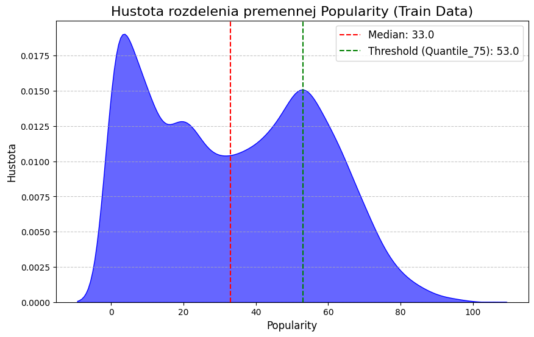
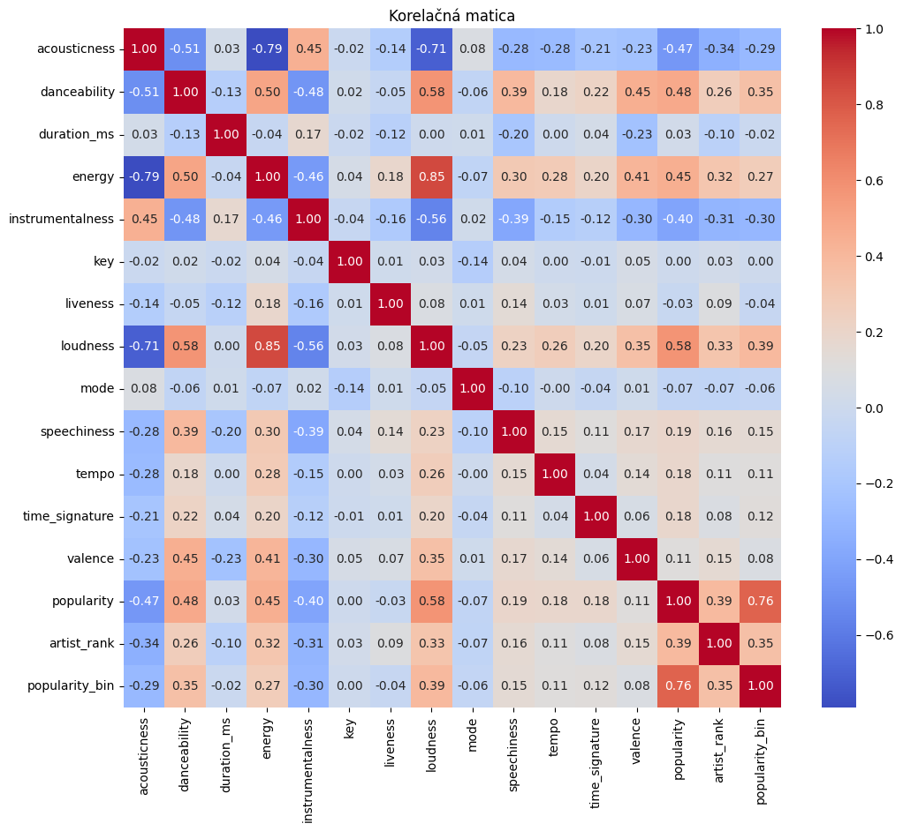
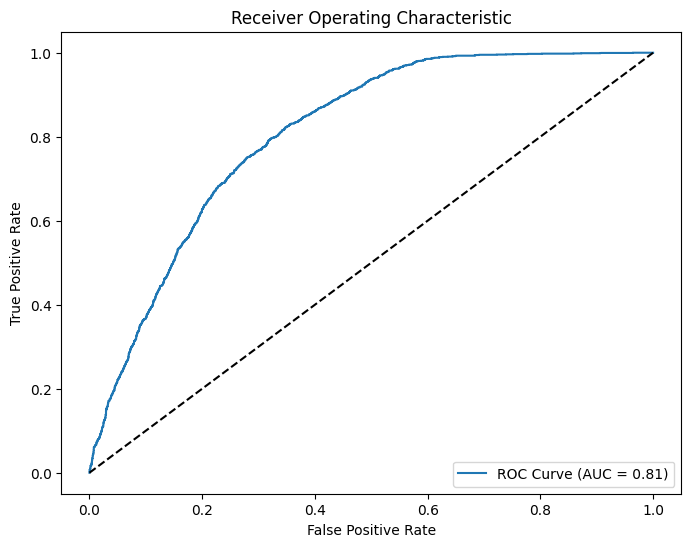
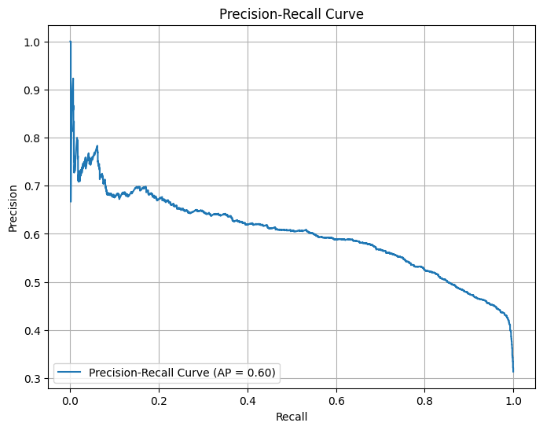
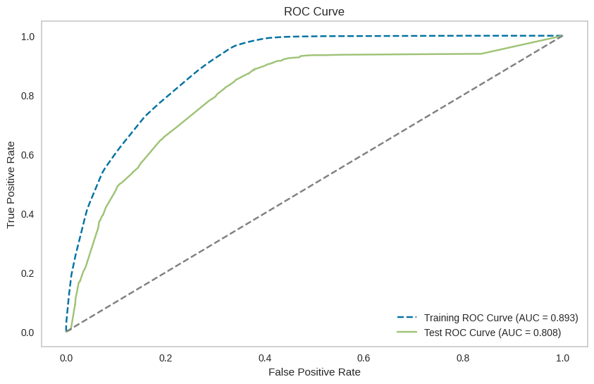
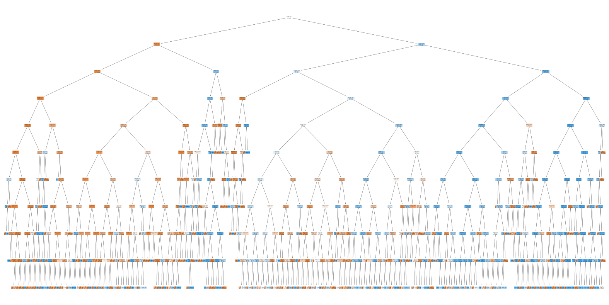
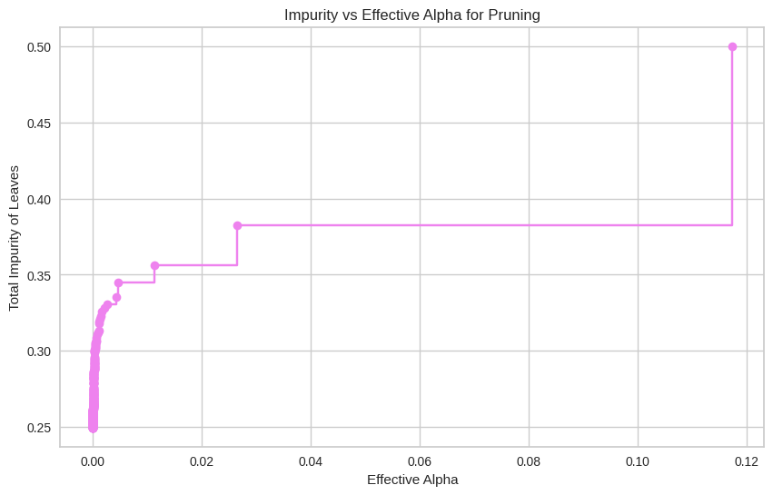
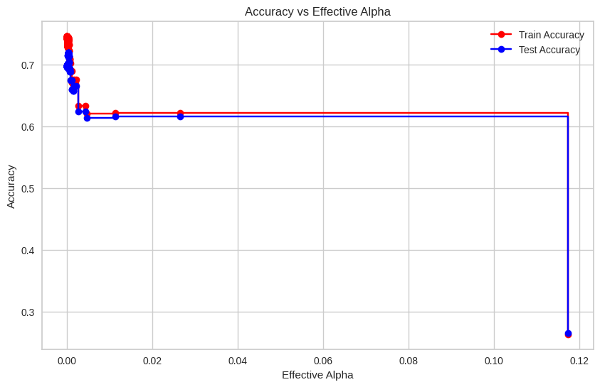
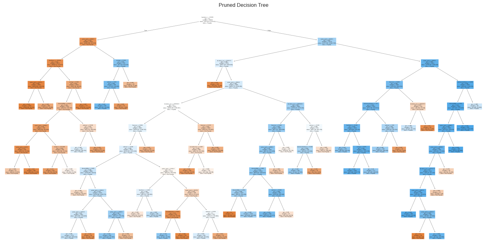
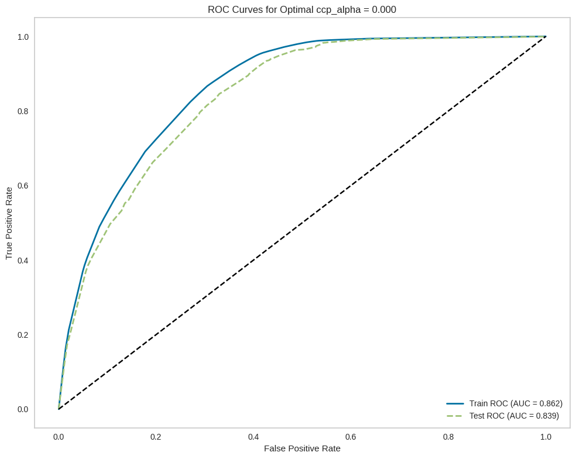

# Prediction-of-music-popularity
## Motivacia
Cieľom tejto analýzy je pochopiť, aké faktory ovplyvňujú popularitu skladieb a využiť tieto poznatky na vytváranie predikčných modelov, ktoré dokážu presne odhadnúť úspešnosť skladieb.

# Datasety
Pre analýzu sme zvolili dataset zo stránky Kaggle ([Spotify Audio Features Dataset](https://www.kaggle.com/datasets/tomigelo/spotify-audio-features)), ktorý obsahuje 17 premenných umožňujúcich analyzovať faktory ovplyvňujúce popularitu skladieb. Dataset je dostatočne rozsiahly, obsahuje **130 325 záznamov**, čo zvyšuje presnosť a spoľahlivosť našej analýzy. Popisy jednotlivých premenných sme doplnili informáciami z oficiálnej stránky Spotify. 
Okrem základného datasetu sme použili aj **druhý zdroj** ([Colab Notebook](https://colab.research.google.com/drive/1yrrDze9huXwDTgrX3TyUxZDU7yDhIwLW#scrollTo=TTPA9CxJf1dz&line=5&uniqifier=1)), ktorý hodnotí popularitu interpretov na Spotify. Tento zdroj sme vybrali s predpokladom, že popularita skladby úzko súvisí s popularitou interpreta. 

### Spracovanie interpretov
Aby sme interpretov reprezentovali kvantitatívnou premennou namiesto kategórie (mena interpreta), priradili sme im hodnotu popularity podľa počtu streamov:
- Dataset obsahuje **3 000 najpopulárnejších interpretov**, zoradených podľa celkového počtu prehratí.
- Interpretom sme priradili pozíciu v rebríčku (zoradenú vzostupne). Najpopulárnejší interpret získal hodnotu **3 000**, menej populárni interpreti nižšie hodnoty.
Spojili sme oba datasety a obmedzili analýzu len na skladby interpretov z **top 3 000**. Po odstránení duplicít v stĺpci `track_id` (identifikátor pesničky) sme pracovali s **29 281 záznamami**. 

### Problémy v dátach
Premenná **popularity** nie je rovnomerne rozdelená. Väčšina skladieb má nižšiu popularitu, čo môže viesť k tomu, že model sa viac prispôsobí skladbám s nižšou popularitou a bude mať problémy s identifikáciou skladieb s vyššou popularitou. Z tohto dôvodu sme pridali nový stĺpec klasifikujúci skladby ako **populárne** alebo **nepopulárne**.
Aby sme skladbu mohli označiť ako populárnu alebo nepopulárnu, rozhodli sme sa pracovať s hodnotou popularity ako **binárnou premennou**. Prahová hodnota bola stanovená na úrovni **75% kvantilu popularity (hodnota 53)**: Skladby s hodnotou popularity ≥ 53 sme označili za **populárne** (top 25%). Týmto sme pripravili základ pre klasifikačné metódy.
 

### Korelačná analýza
Pre analýzu korelácií sme zvolili **Spearmanovu koreláciu**, ktorá lepšie zachytáva nelineárne vzťahy. Výrazné korelácie sme pozorovali pri:
- **Pozitívna korelácia**: `danceability`, `energy`, `loudness`, `artist_rank`.
- **Negatívna korelácia**: `acousticness`, `instrumentalness`.
  

---

# Predikčné Modely

Dáta sme spracovali pomocou štyroch rôznych metód a porovnali ich výsledky na testovacom súbore.

### Regresné Metódy
Cieľom bolo predikovať hodnotu popularity. Aby sme ich mohli porovnať s klasifikačnými metódami, odhad sme považovali za správny, ak bol v tolerancii **±5** od skutočnej hodnoty.
- **Lineárna regresia**
- **KNN regresia**

### Klasifikačné Metódy
Cieľom bolo predikovať popularitu skladby ako **binárnu premennú** (`popularity_bin`), kde skladby označujeme za populárne, ak patria do top 25 %.
- **Logistická regresia**
- **KNN klasifikácia**
- **Rozhodovací strom**

## Lineárna Regresia

Najskôr sme sa zamerali na analýzu popularity pomocou lineárnej regresie. Tento model pracuje so stĺpcom **popularity** (nie s binárnym stĺpcom `popularity_bin`), pretože lineárna regresia nie je vhodná na binárne klasifikácie – na tento účel sa používa logistická regresia (viď nižšie). Implementáciu lineárnej regresie sme postupne zlepšovali pomocou cross-validácie. Keďže je veľmi náročné predpovedať presnú hodnotu popularity na úroveň percenta, zaviedli sme toleranciu ±5, ktorú považujeme za prijateľný odhad (tolerancia sa uplatňuje pri výpočte presnosti).

### Kroky

### Príprava Dát
1. **Odstránenie stĺpcov**: Odstránili sme stĺpce ako `duration_ms`, `key` a `tempo`. Na základe korelačnej matice sme zistili, že tieto premenné nemajú významný vplyv na model a ich zahrnutie by ho zbytočne komplikovalo.

#### Optimalizácia Modelu
1. **Cross-validácia**: 
   - Optimalizovali sme počet foldov v rámci cross-validácie. Najlepšie výsledky sme pozorovali pri **40 foldoch**, kde sa **Mean Squared Error (MSE)** stabilizovalo.

2. **Regularizácia (Lasso regresia)**:
   - Pri optimalizácii parametra `alpha` pre Lasso regresiu, ktorý znižuje riziko overfittingu, sme zistili, že najlepšie výsledky dosahuje najnižšia hodnota `alpha`. To naznačuje, že regularizácia neprináša výrazný prínos. Preto sme sa rozhodli Lasso regresiu nepoužiť.

3. **Polynomiálna transformácia**:
   - Na základe grafu sme zistili, že dáta nie sú lineárne, a preto sme aplikovali polynomiálnu transformáciu až do tretieho stupňa. Všetky tieto optimalizácie sme implementovali a aplikovali na testovaciu množinu.

### Výsledky
Podarilo sa nám znížiť hodnotu MSE na testovacej sade z pôvodných **298.8** na **256.1**, čo predstavuje zlepšenie o takmer **15 %**. Toto zlepšenie hodnotíme pozitívne. Napriek tomu je predpoveď stále ďaleko od použiteľnej presnosti. Model nám poskytol zaujímavé poznatky o vzťahoch medzi premennými a potvrdil, že lineárna regresia nie je správnym modelom pre tieto dáta. 

#### Poznatky o vplyve premenných
- **Pozitívny vplyv na popularitu**: `danceability`
- **Negatívny vplyv na popularitu**: `acousticness`, `energy`, `instrumentalness`, `speechiness`

#### Hodnotenie presnosti
Aby sme mohli porovnať náš model s inými prístupmi, rozhodli sme sa použiť metódu presnosti (**accuracy**). Lineárna regresia je v tomto prípade v nevýhode, pretože na rozdiel od iných modelov nepracuje s binárnou premennou `popularity_bin`, ale s reálnou hodnotou popularity. To si vyžaduje veľmi presné predpovede.

Zaviedli sme toleranciu ±5, v rámci ktorej považujeme predikciu za správnu. Aj napriek tejto tolerancii sme dosiahli len **25,7 % presnosti**, čo nie je uspokojivý výsledok. Preto sme sa rozhodli zmeniť prístup a zamerať sa na klasifikáciu.

## Logisticka Regresia

Cieľom je vytvoriť model, ktorý dokáže spoľahlivo rozlíšiť medzi populárnymi a menej populárnymi piesňami. Pieseň definujeme ako populárnu, ak jej kvantilová hodnota dosahuje alebo prekračuje 75 %. Túto informáciu reprezentujeme binárnou premennou `popularity_bin`, kde:
- **1** označuje populárnu pieseň
- **0** označuje menej populárnu pieseň.

Na základe širokého spektra hudobných atribútov, ako sú tanečnosť, energia a akustickosť, sme zvolili logistickú regresiu ako vhodný nástroj pre túto binárnu klasifikáciu. Logistická regresia umožňuje odhadnúť pravdepodobnosť, že daná pieseň patrí do kategórie populárnych.

---

### Úprava dát
Pôvodný dataset bol značne nevyvážený v prospech triedy menej populárnych piesní. Aby sme zabránili zaujatosti modelu, použili sme techniku **SMOTE (Synthetic Minority Oversampling Technique)**. Táto metóda synteticky generuje nové príklady pre menšinovú triedu na základe existujúcich dát, čím sme zabezpečili rovnomerné zastúpenie oboch tried.

---

### Výsledky modelu

| Metrika       | Hodnota  |
|---------------|----------|
| **Presnosť**  | 73 %     |
| **Precision** | 55 %     |
| **Recall**    | 75 %     |
| **F1-score**  | 63 %     |

Model dosiahol prijateľnú celkovú presnosť (73 %), avšak detailnejšia analýza odhalila rozdiely vo výkone medzi jednotlivými triedami.

### Výkonnosť podľa tried

#### Trieda 0: Menej populárne piesne
- **Precision**: Vysoká, čo znamená, že väčšina piesní označených ako „menej populárne“ je správna.
- **Recall**: 72 %, čo ukazuje, že model správne identifikuje väčšinu menej populárnych piesní.

#### Trieda 1: Populárne piesne
- **Precision**: 55 %, teda niečo vyše polovice piesní označených ako „populárne“ je skutočne populárnych.
- **Recall**: 75 %, čo znamená, že model dokáže identifikovať väčšinu populárnych piesní.

---

## Matica zámien (Confusion Matrix)

|                 | Predikované menej populárne | Predikované populárne |
|-----------------|-----------------------------|-----------------------|
| **Nepopulárne** | 2907 (True Negatives)     | 1113 (False Positives) |
| **Populárne**      | 467 (False Negatives)      | 1370 (True Positives)  |

---

### ROC krivka a AUC
**ROC krivka** graficky zobrazuje vzťah medzi True Positive Rate (Recall) a False Positive Rate pri rôznych prahových hodnotách klasifikácie.

- **AUC (plocha pod krivkou):** 0.81  
Táto hodnota naznačuje veľmi dobrý výkon modelu pri rozlišovaní medzi populárnymi a menej populárnymi skladbami.

---

### Precision-Recall krivka
**Precision-Recall krivka** ukazuje vzťah medzi presnosťou (precision) a úplnosťou (recall) pri rôznych prahoch klasifikácie.

- Na začiatku krivky, keď je recall nízky, model dosahuje veľmi vysokú presnosť. Znamená to, že model je v tomto režime opatrný a označuje za populárne iba piesne, o ktorých je veľmi presvedčený.
- So zvyšovaním recall (snaha identifikovať viac populárnych piesní) dochádza k poklesu presnosti, pretože model začne nesprávne označovať niektoré piesne ako populárne.
- **Priemerná presnosť (AP):** 0.60, čo naznačuje uspokojivý, ale nie výnimočný výkon modelu.

---

Výsledky modelu logistickej regresie s **ROC-AUC 0.81** a presnosťou **73 %** naznačujú solídny výkon, najmä pri klasifikácii menej populárnych piesní. Model dokáže identifikovať väčšinu populárnych piesní (vysoký recall), avšak nižšia presnosť naznačuje určité problémy pri správnom určení populárnych skladieb.

## Rozhodovací strom

V tejto implementácii sme použili klasifikačný rozhodovací strom na analýzu dát, pričom sme sa zamerali na optimalizáciu jeho výkonu pomocou prerezávania. Rozhodovacie stromy často trpia problémom pretrénovania, keďže model zachytáva šum v dátach. Preto sme aplikovali techniku prerezávania, ktorá umožňuje zjednodušenie modelu odstránením nepotrebných uzlov.

---

### Výsledky neprerezaného modelu

Použili sme klasifikačný rozhodovací strom s maximálnou hĺbkou 10 a vyvážením tried pomocou parametra `class_weight='balanced'`. Ak by tento parameter nebol nastavený, model by predpokladal, že všetky triedy majú rovnakú váhu, bez ohľadu na ich početnosť v dátach. To znamená, že dominantná trieda by mala vyššiu prioritu a model by sa snažil minimalizovať chyby na početnejšej triede, čo by viedlo k tomu, že by zase ignoroval menej početne triedy.

---

### Trénovacie dáta
| Metrika                          | Hodnota   |
|-----------------------------------|-----------|
| **Tréningová presnosť**          | 74.50 %   |
| **Recall (citlivosť) pre triedu 1** | 96 %      |
| **Precision (presnosť) pre triedu 1** | 51 %   |
| **F1-score pre triedu 1**         | 0.66      |

- Náš model dokáže zachytiť takmer všetky populárne skladby (recall), čo je zásadné pre náš cieľ.
- Model má pri predikcii triedy 1 viac falošne pozitívnych prípadov (Precision), teda nepopulárne skladby označí ako populárne. Toto je problém.
- **F1-score pre triedu 1**: 0.66 – ukazuje, že model má slušný balans medzi presnosťou a citlivosťou pri predikcii populárnych skladieb.
Celkový výkon modelu na dátach je slušný, no nie perfektný.

---

### Testovacie dáta
| Metrika                          | Hodnota   |
|-----------------------------------|-----------|
| **Recall (citlivosť) pre triedu 1** | 87 %      |
| **Precision (presnosť) pre triedu 1** | 46 %    |
| **F1-score pre triedu 1**         | 0.60      |
| **Celková presnosť**             | 69.6 %    |

- Aj na nových dátach model zachytí väčšinu populárnych skladieb (Recall). Model spoľahlivo zachytáva väčšinu populárnych skladieb, čo je kľúčové pre náš cieľ.
- **Celková presnosť**: 69.6 % – výkon modelu na testovacích dátach je primeraný, hoci hlavný dôraz je na triedu 1.
- Relatívne nízka presnosť pre triedu 1 (51 % na tréningových a 46 % na testovacích dátach) signalizuje, že model často označuje nepopulárne skladby ako populárne, čo by mohlo byť zlepšené ďalším ladením.

---

### ROC-AUC krivka

- **AUC skóre pre tréningovú množinu**: 0.893 – Model má veľmi dobrú schopnosť odlišovať medzi triedami na tréningových dátach. AUC hodnota 0.893 naznačuje, že model efektívne zachytáva rozdiely medzi populárnymi a nepopulárnymi skladbami počas tréningu.
- **AUC skóre pre testovaciu množinu**: 0.808 – Výkon modelu na testovacích dátach je stále dobrý, ale mierne slabší ako na tréningových dátach. Tento rozdiel (0.085) naznačuje, že model nie je výrazne pretrénovaný a dokáže generalizovať na nové dáta.

#### Tvar ROC kriviek
- Tréningová krivka je bližšie k hornému ľavému rohu, čo značí vyššiu citlivosť pri zachovaní nízkeho množstva falošne pozitívnych predikcií.
- Testovacia krivka je podobná, no mierne posunutá nižšie – model na testovacích dátach niekedy generuje viac falošne pozitívnych predikcií.

---

### Tvar rozhodovacieho stromu

Strom má veľkú hĺbku a je komplikovaný. To môže byť dôvodom mierneho pretrénovania. Orezanie by mohlo výkon takéhoto komplexného stromu zlepšiť. Hoci neprerezaný strom dosiahol vysokú presnosť na tréningových dátach, na testovacích dátach sa objavili známky pretrénovania – model bol príliš komplexný a mierne prispôsobený detailom trénovacích dát, čo znížilo jeho schopnosť generalizovať na nové dáta.

Aby sme tento problém vyriešili, pristúpili sme k prerezávaniu stromu pomocou techniky nákladovej komplexnosti (cost complexity pruning). Cieľom je odstrániť zbytočné uzly stromu a dosiahnuť jednoduchší, robustnejší model.

- **Hľadanie parametra alpha**: Hľadáme hodnotu alfa, ktorá vyváži nízku nečistotu a zjednodušenie stromu. Pomocou funkcie cost_complexity_pruning_path sme identifikovali hodnoty ccp_alpha a postupne zjednodušovali strom odstránením uzlov, ktoré minimálne prispievali k zlepšeniu modelu.

- Os X - Hodnota alfa, ktorá určuje mieru prerezávania. Čím je hodnota vyššia, tým viac vetiev sa odstráni.
- Os Y - celková nečistota listov stromu. Táto hodnota narastá s rastúcou hodnotou alfa, pretože odstránením vetiev dochádza k zjednodušeniu stromu, ale zároveň k zníženiu schopnosti stromu prispôsobiť sa trénovacím dátam.

  Každý prerezaný strom bol vyhodnotený na základe presnosti na tréningových a testovacích dátach, pričom sme sledovali aj robustnosť modelu a jeho schopnosť generalizácie. Nakoniec sme vybrali optimálny strom, ktorý dosiahol najlepšiu testovaciu presnosť.

Tento graf zobrazuje závislosť medzi hodnotou ccp_alpha (parametra pre prerezávanie rozhodovacieho stromu) a presnosťou modelu na tréningových a testovacích dátach.

- Pri nízkych hodnotách alfa je model pretrénovaný, čo vedie k vysokej presnosti na tréningových dátach, ale slabšej na testovacích.
- Pri veľmi vysokých hodnotách alfa dochádza k underfittingu, keď je strom príliš zjednodušený a nedokáže zachytiť dôležité vzory v dátach.
Zvolíme hodnotu ccp_alpha v rozsahu 0.01 - 0.03, kde model dosahuje najlepšiu rovnováhu medzi presnosťou na tréningových a testovacích dátach.

---

### Vizualizácia optimálneho zrezaného stromu

Prerezaný strom neobsahuje nepodstatné vetvy a je menej komplexný. Výsledkom je model, ktorý je ľahšie interpretovateľný, robustnejší a dúfame, že bude lepšie generalizovať na nové dáta.

---

### Porovnanie výsledkov prerezaného a neprerezaného stromu

| Metrika                  	 | Neorezaný strom | Prerezaný strom | Zmena |
|---------------------------|------------------|------------------|-------|
| Tréningová presnosť       | 74.6 %           | 74.0 %           | Mierny pokles v presnosti |
| Testovacia presnosť       | 69.6 %           | 71.9 %           | Zlepšenie presnosti na testovacích dátach |
| Precision (trieda 1)      | 0.46             | 0.48             | Mierne zlepšenie |
| Recall (trieda 1)         | 0.87             | 0.83             | Mierny pokles citlivosti |
| F1-score (trieda 1)       | 0.60             | 0.61             | Mierne zlepšenie |

### Záver
- Prerezaný strom dosahuje vyššiu presnosť na testovacích dátach, čo naznačuje, že sa lepšie generalizuje na nové dáta.
- Prerezaný strom má mierne nižšiu presnosť na tréningových dátach, čo je znakom eliminácie nadmerného prispôsobenia trénovacím dátam.
- F1-score pre populárne skladby sa mierne zlepšilo, čo naznačuje lepší kompromis medzi presnosťou a citlivosťou.
- Prerezanie stromu znížilo citlivosť (recall) pre populárne skladby, ale zlepšilo presnosť a generalizáciu.

---

### ROC-AUC orezaný strom

Krivky ROC pre tréningové a testovacie dáta sú podobné. Prerezaný model si zachováva konzistentný výkon na rôznych dátach.
- **AUC pre testovaciu množinu**: Prerezaný model dosahuje AUC = 0.839, čo je vyššia hodnota v porovnaní s AUC neorezaného modelu (0.808).
- Rozdiel medzi AUC na tréningových dátach (0.862) a testovacích dátach (0.839) je malý, čo ukazuje, že prerezaný model nie je výrazne pretrénovaný.

---

